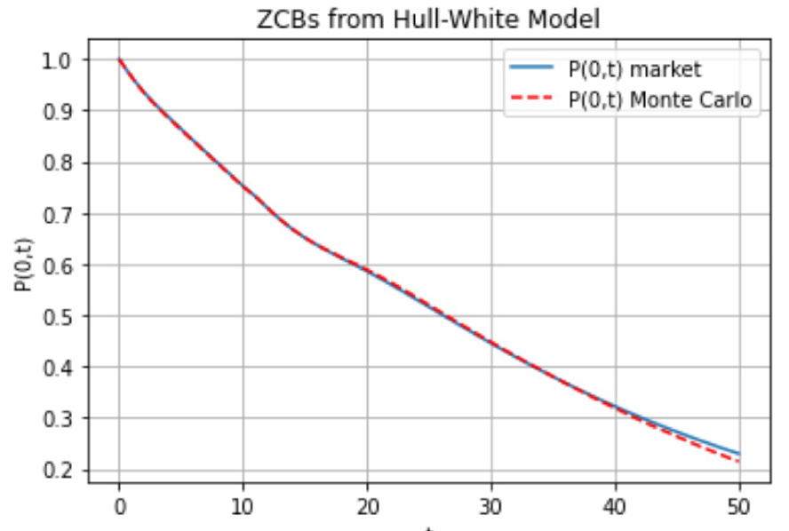

<h1 align="center" style="border-botom: none">
  <b>
  🐍 Check if the average of a HJM framework returns the input term structure 🐍
 </b>
</h1>

 
Checks if the stochastic scenarios from Hull-White model fit the term structure 

  <a href="https://github.com/opem-source-modelling" target="_blank">
    <picture>
      
    </picture>
  </a>

